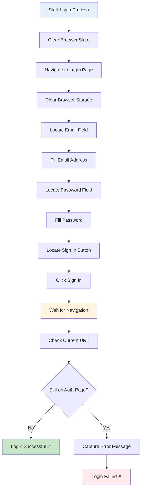
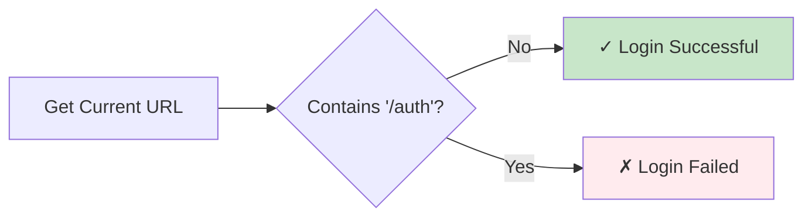
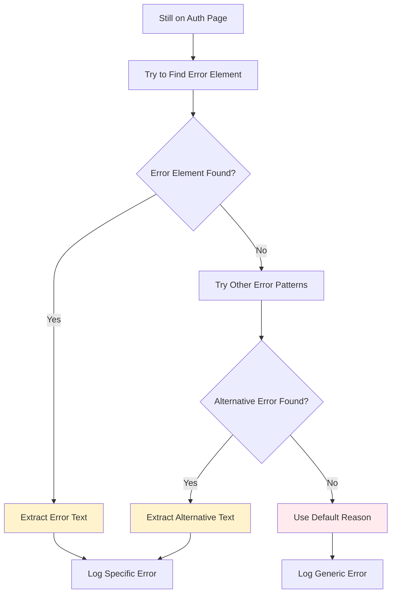

# Lucatris Login Step-by-Step Guide

## 🎯 Overview

This guide documents the exact login process used in the Lucatris automation test, based on the actual implementation in `lucatris-login-email.spec.ts`. Each step corresponds to specific actions in the test code.

---

## 🔄 Complete Login Flow



---

## 📋 Detailed Step-by-Step Process

### Step 1: Initialize Browser State

**Purpose:** Clean browser environment before each login attempt

**Code Implementation:**
```typescript
// Clear cookies before each login attempt
try {
  await context.clearCookies();
} catch {
  // Context might be closed, continue
}
```

**What Happens:**
- All existing cookies are deleted from browser context
- Ensures no previous login sessions interfere with new attempt
- Error handling prevents crashes if browser context is closed


---

### Step 2: Navigate to Login Page

**Purpose:** Load the Lucatris authentication page

**Code Implementation:**
```typescript
await page.goto('https://lucatris.com/auth', { timeout: 60000 });
```

**What Happens:**
- Browser navigates to `https://lucatris.com/auth`
- Page loads completely with 60-second timeout
- Ready for user interaction


---

### Step 3: Clear Browser Storage

**Purpose:** Remove any stored local data that might affect login

**Code Implementation:**
```typescript
try {
  await page.evaluate(() => {
    localStorage.clear();
    sessionStorage.clear();
  });
} catch {
  // Storage not accessible, continue
}
```

**What Happens:**
- `localStorage` data is cleared
- `sessionStorage` data is cleared
- Error handling for cases where storage access is blocked

---

### Step 4: Locate and Fill Email Field

**Purpose:** Enter the user's email address

**Code Implementation:**
```typescript
await page.getByRole('textbox', { name: 'Email' }).fill(user.email);
```

**What Happens:**
- Playwright locates the email input field by role and name
- Field is filled with the user's email from CSV data
- Email format: `user.email` (e.g., `john.doe@company.com`)

**Field Location Strategy:**
- Element Type: `textbox`
- Accessible Name: `Email`
- Method: `getByRole()`


---

### Step 5: Locate and Fill Password Field

**Purpose:** Enter the password for authentication

**Code Implementation:**
```typescript
await page.getByRole('textbox', { name: 'Password' }).fill(password);
```

**What Happens:**
- Playwright locates the password input field
- Field is filled with hardcoded password: `rui123`
- Same role-based location strategy as email field

**Password Details:**
- Default: `rui123`
- Source: Hardcoded in test
- Can be modified in test configuration


---

### Step 6: Locate and Click Sign In Button

**Purpose:** Submit the login form

**Code Implementation:**
```typescript
await page.getByRole('button', { name: 'Sign in' }).click();
```

**What Happens:**
- Playwright locates the submit button by role and name
- Button is clicked to submit the form
- Authentication request is sent to server

**Button Location Strategy:**
- Element Type: `button`
- Accessible Name: `Sign in`
- Action: `click()`


---

### Step 7: Wait for Navigation

**Purpose:** Allow time for server response and page transition

**Code Implementation:**
```typescript
await page.waitForTimeout(3000);
```

**What Happens:**
- Test pauses for 3 seconds
- Allows server to process authentication
- Time for page redirect if login successful
- Prevents premature status checking

**Why 3 Seconds:**
- Sufficient for most network responses
- Balances speed and reliability
- Can be adjusted based on network conditions


---

### Step 8: Check Login Status

**Purpose:** Determine if login was successful

**Code Implementation:**
```typescript
const currentUrl = page.url();
const isLoggedIn = !currentUrl.includes('/auth');
```

**What Happens:**
- Current URL is retrieved
- Login success determined by URL change
- Success: URL no longer contains `/auth`
- Failure: Still on authentication page

**Status Logic:**


---

## ✅ Success Scenario

### When Login Succeeds

**Expected Behavior:**
1. URL changes from `/auth` to dashboard/main page
2. Success message logged to console
3. User added to `successUsers` array
4. Browser state cleaned up for next test

**Console Output:**
```
✓ SUCCESS - Logged in successfully (redirected to: https://lucatris.com/dashboard)
```

**Code Response:**
```typescript
successUsers.push({ 
  name: user.name, 
  email: user.email, 
  role: user.role, 
  branch: user.branch 
});
```

**Cleanup Process:**
```typescript
try {
  await page.waitForTimeout(1000);
  await context.clearCookies();
} catch {
  // Ignore logout errors
}
```

---

## ❌ Failure Scenario

### When Login Fails

**Expected Behavior:**
1. URL remains on `/auth` page
2. Error message captured from page
3. User added to `failedUsers` array with reason
4. Detailed error logging

**Error Detection Process:**



**Error Search Strategy:**
```typescript
// Try to find error message
const errorText = page.locator('[class*="error"], [class*="alert"], [role="alert"]');
if (await errorText.count() > 0) {
  reason = await errorText.first().innerText();
} else {
  // Try other common error patterns
  const invalidError = page.getByText(/invalid|incorrect|wrong|error|gagal|not found/i);
  if (await invalidError.count() > 0) {
    reason = await invalidError.first().innerText();
  }
}
```

**Common Error Messages:**
- "Invalid email or password"
- "Incorrect credentials"
- "User not found"
- "Account locked"

**Console Output:**
```
✗ FAILED - Invalid email or password
```

---

## 🔧 Error Handling and Recovery

### Network/Connection Errors

**Detection:**
```typescript
if (errorMessage.includes('Target page, context or browser has been closed') ||
    errorMessage.includes('Protocol error')) {
  console.log('Browser closed unexpectedly, saving partial results...');
  break;
}
```

**Recovery Actions:**
- Save partial results immediately
- Stop test execution gracefully
- Preserve data collected so far

### Browser State Issues

**Common Problems:**
- Browser window closed unexpectedly
- Network timeouts
- Page crashes
- Context termination

**Handling Strategy:**
- Try-catch blocks around browser operations
- Graceful degradation when operations fail
- Data preservation as priority

---

## 📊 Results Processing

### Success Data Structure

```typescript
successUsers: { 
  name: string; 
  email: string; 
  role: string; 
  branch: string; 
}[]
```

### Failure Data Structure

```typescript
failedUsers: { 
  name: string; 
  email: string; 
  role: string; 
  branch: string; 
  reason: string; 
}[]
```

### Report Generation

After all users processed:
1. Generate timestamped markdown file
2. Include summary statistics
3. List successful logins with details
4. List failed logins with error reasons
5. Save to `test-results` directory

---

## 🎯 Key Takeaways

### Login Process Summary
1. **Clean State**: Clear cookies and storage
2. **Navigate**: Load authentication page
3. **Fill Forms**: Enter email and password
4. **Submit**: Click sign-in button
5. **Wait**: Allow server response time
6. **Verify**: Check URL change for success
7. **Handle**: Capture errors appropriately
8. **Cleanup**: Prepare for next attempt

### Critical Success Factors
- **Clean browser state** prevents session interference
- **Proper wait times** ensure accurate status checking
- **Robust error handling** captures all failure scenarios
- **Data preservation** ensures test results aren't lost

### Common Failure Points
- Network connectivity issues
- Incorrect credentials
- Server-side authentication problems
- Browser state corruption

This step-by-step guide reflects the actual implementation in your test code, providing accurate documentation of how the login process works in practice.