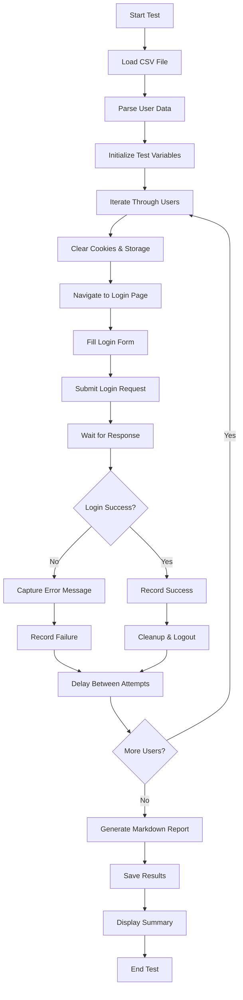

# Lucatris Login Email Test - Technical Documentation

## 1. Overview

The Lucatris Login Email Test (`lucatris-login-email.spec.ts`) is a comprehensive automated testing solution designed to validate user authentication across the Lucatris regulatory application. This test framework systematically verifies login functionality for multiple users by reading credentials from a CSV data source and generating detailed test reports in markdown format.

### Key Features
- **Bulk User Authentication**: Tests login credentials for multiple users from a single CSV file
- **CSV Data Integration**: Parses semicolon-delimited user data with flexible field handling
- **Comprehensive Error Handling**: Robust error recovery with browser closure detection
- **Detailed Reporting**: Generates timestamped markdown reports with success/failure analysis
- **Storage Management**: Automatic cookie and storage clearing between test iterations
- **Timeout Management**: Extended timeout for large-scale testing scenarios

## 2. Prerequisites

### 2.1 Software Requirements
- **Node.js**: Version 16.x or higher
- **Playwright**: Version 1.56.0 or higher
- **TypeScript**: For type safety and enhanced development experience

### 2.2 Project Dependencies
```json
{
  "devDependencies": {
    "@playwright/test": "^1.56.0",
    "@types/node": "^24.7.0"
  }
}
```

### 2.3 File Structure Requirements
```
project-root/
├── tests/
│   └── lucatris-login-email.spec.ts
├── data/
│   └── user qims regu.csv
├── test-results/
│   └── (auto-generated)
├── package.json
└── playwright.config.ts
```

### 2.4 Browser Setup
- Chrome/Chromium browser installed
- Playwright browsers installed (`npx playwright install`)

## 3. Test Data Structure (CSV Format)

### 3.1 CSV File Location
The test expects the CSV file at: `../data/user qims regu.csv` relative to the test file.

### 3.2 CSV Format Specification
The CSV file uses semicolon (`;`) as a delimiter and follows this structure:

```csv
Name;Email;Role;Branch;ERP;QIMS Login;Lucatris Login;Remark
```

#### Field Descriptions
| Field | Required | Description | Example |
|-------|----------|-------------|---------|
| Name | Yes | Full name of the user | SHAVARNA FARHAD |
| Email | Yes | Email address for login | shavarna.farhad@radiant-utama.com |
| Role | No | Job role or position | BRANCH OPERATION MANAGER |
| Branch | No | Office location | Batam |
| ERP | No | ERP system access flag | YES |
| QIMS Login | No | QIMS system access flag | YES |
| Lucatris Login | No | Lucatris system access flag | YES |
| Remark | No | Additional notes | Email list berbeda dengan ERP |

### 3.3 Data Validation Rules
- **Email Validation**: Only rows with valid email addresses (containing `@`) are processed
- **Header Skipping**: First row is automatically skipped as header
- **Empty Row Handling**: Blank lines are ignored
- **Minimum Fields**: At least 2 fields (Name, Email) are required for processing

## 4. Execution Steps

### 4.1 Test Workflow Diagram



### 4.2 Detailed Execution Process

#### 4.2.1 Initialization Phase
```typescript
// Set extended timeout for bulk testing
test.setTimeout(1800000); // 30 minutes

// Load and parse user data
const users = parseUserListCsv(userListPath);
```

#### 4.2.2 User Iteration Loop
For each user in the CSV:

1. **Pre-test Cleanup**
```typescript
// Clear cookies and storage
await context.clearCookies();
await page.evaluate(() => {
  localStorage.clear();
  sessionStorage.clear();
});
```

2. **Navigation and Authentication**
```typescript
// Navigate to login page
await page.goto('https://lucatris.com/auth', { timeout: 60000 });

// Fill credentials
await page.getByRole('textbox', { name: 'Email' }).fill(user.email);
await page.getByRole('textbox', { name: 'Password' }).fill(password);

// Submit login
await page.getByRole('button', { name: 'Sign in' }).click();
```

3. **Result Validation**
```typescript
// Check login success by URL redirection
const currentUrl = page.url();
const isLoggedIn = !currentUrl.includes('/auth');
```

### 4.3 Running the Test

#### Command Line Execution
```bash
# Run specific test file
npx playwright test tests/lucatris-login-email.spec.ts

# Run with headed mode for debugging
npx playwright test tests/lucatris-login-email.spec.ts --headed

# Run with specific browser
npx playwright test tests/lucatris-login-email.spec.ts --project=chromium
```

#### VS Code Integration
1. Install Playwright VS Code extension
2. Use "Playwright Test" panel to run tests
3. Click on test file to execute individual tests

## 5. Expected Outputs

### 5.1 Console Output
```
========================================
Lucatris Login Test - Total users: 154
========================================

[1/154] Testing: SHAVARNA FARHAD (shavarna.farhad@radiant-utama.com)
  ✓ SUCCESS - Logged in successfully (redirected to: https://lucatris.com/dashboard)
[2/154] Testing: DARMANTO (darmanto@radiant-utama.com)
  ✗ FAILED - Invalid credentials
...

========================================
TEST COMPLETE
========================================
Total tested: 154
Successful: 98
Failed: 56
Results saved to: test-results/lucatris-login-results-2026-01-30T15-30-45-123Z.md
========================================
```

### 5.2 Markdown Report Format

#### File Naming Convention
`lucatris-login-results-{timestamp}.md`

#### Report Structure
```markdown
# Lucatris Login Test Results

**Date:** 2026-01-30T15:30:45.123Z
**Password Used:** rui123

## Summary

| Metric | Count |
|--------|-------|
| Total Tested | 154 |
| Successful | 98 |
| Failed | 56 |

## Successful Logins (98)

| No | Name | Email | Role | Branch | Remark |
|----|------|-------|------|--------|--------|
| 1 | SHAVARNA FARHAD | shavarna.farhad@radiant-utama.com | BRANCH OPERATION MANAGER | Batam | Login successful |
| 2 | DARMANTO | darmanto@radiant-utama.com | PROJECT MANAGER | Batam | Login successful |
...

## Failed Logins (56)

| No | Name | Email | Role | Branch | Remark |
|----|------|-------|------|--------|--------|
| 1 | BOBY SAFRA MADONA | boby.madona@radiant-utama.com | Inspector | Batam | Invalid credentials |
| 2 | ERIZAL | erizal@radiant-utama.com | Admin Proj | Batam | Account locked |
...
```

## 6. Error Handling

### 6.1 Error Recovery Mechanisms

#### 6.1.1 Browser Closure Detection
```typescript
// Detect browser closure scenarios
if (errorMessage.includes('Target page, context or browser has been closed') ||
    errorMessage.includes('Protocol error')) {
  console.log('Browser closed unexpectedly, saving partial results...');
  break;
}
```

#### 6.1.2 Storage Access Errors
```typescript
try {
  await page.evaluate(() => {
    localStorage.clear();
    sessionStorage.clear();
  });
} catch {
  // Storage not accessible, continue
}
```

#### 6.1.3 Cookie Clearing Failures
```typescript
try {
  await context.clearCookies();
} catch {
  // Context might be closed, continue
}
```

### 6.2 Error Message Detection
The test employs multiple strategies to capture login error messages:

```typescript
// Primary error detection
const errorText = page.locator('[class*="error"], [class*="alert"], [role="alert"]');
if (await errorText.count() > 0) {
  reason = await errorText.first().innerText();
} else {
  // Fallback pattern matching
  const invalidError = page.getByText(/invalid|incorrect|wrong|error|gagal|not found/i);
  if (await invalidError.count() > 0) {
    reason = await invalidError.first().innerText();
  }
}
```

### 6.3 Common Error Scenarios

| Error Type | Detection Method | Recovery Action |
|------------|------------------|-----------------|
| Browser Closure | Exception message detection | Save partial results, exit loop |
| Network Timeout | Page timeout configuration | Continue with next user |
| Invalid Credentials | Error message parsing | Record failure, continue |
| Storage Access | Try-catch blocks | Continue execution |
| Context Closure | Exception handling | Save and exit |

## 7. Configuration Options

### 7.1 Test Configuration

#### Timeout Settings
```typescript
// Test timeout (30 minutes for bulk testing)
test.setTimeout(1800000);

// Page navigation timeout
await page.goto('https://lucatris.com/auth', { timeout: 60000 });
```

#### Timing Delays
```typescript
// Post-login wait
await page.waitForTimeout(3000);

// Between-user delay
await page.waitForTimeout(1000);

// Logout delay
await page.waitForTimeout(1000);
```

### 7.2 Environment Variables
The test supports standard Playwright environment variables:

| Variable | Description | Example |
|----------|-------------|---------|
| `CI` | Enables CI mode with specific settings | `true` |
| `PW_TEST_TIMEOUT` | Override default test timeout | `1800000` |

### 7.3 Playwright Configuration
Refer to `playwright.config.ts` for additional configuration options:

```typescript
export default defineConfig({
  testDir: './tests',
  fullyParallel: true,
  forbidOnly: !!process.env.CI,
  retries: process.env.CI ? 2 : 0,
  workers: process.env.CI ? 1 : undefined,
  reporter: 'html',
  trace: 'on-first-retry',
});
```

## 8. Troubleshooting

### 8.1 Common Issues and Solutions

#### 8.1.1 CSV File Not Found
**Issue**: `Error: ENOENT: no such file or directory`
**Solution**: Ensure CSV file exists at `../data/user qims regu.csv`

**Verification**:
```bash
# Check file existence
ls -la data/user\ qims\ regu.csv
```

#### 8.1.2 Invalid Email Format
**Issue**: Users with invalid emails are skipped
**Solution**: Verify email format in CSV (must contain `@`)

**CSV Example**:
```csv
# Correct
shavarna.farhad@radiant-utama.com

# Incorrect
shavarna.farhad.radiant-utama.com
```

#### 8.1.3 Browser Timeout Issues
**Issue**: Tests fail due to slow page loads
**Solution**: Increase timeout values:

```typescript
// Increase navigation timeout
await page.goto('https://lucatris.com/auth', { timeout: 120000 });

// Increase overall test timeout
test.setTimeout(3600000); // 1 hour
```

#### 8.1.4 Authentication Changes
**Issue**: Login form structure changes break test
**Solution**: Update selectors in test:

```typescript
// Update selectors based on new form structure
await page.getByRole('textbox', { name: 'NewEmailLabel' }).fill(user.email);
await page.getByRole('textbox', { name: 'NewPasswordLabel' }).fill(password);
await page.getByRole('button', { name: 'NewSignInText' }).click();
```

### 8.2 Debugging Techniques

#### 8.2.1 Headed Mode Testing
```bash
# Run with visible browser for debugging
npx playwright test tests/lucatris-login-email.spec.ts --headed
```

#### 8.2.2 Step-by-Step Execution
```bash
# Run with debugging
npx playwright test tests/lucatris-login-email.spec.ts --debug
```

#### 8.2.3 Screenshot Capture
Add debugging screenshots:
```typescript
// Capture screenshot on error
try {
  // Test actions
} catch (error) {
  await page.screenshot({ path: `error-${user.name.replace(/\s+/g, '-')}.png` });
  throw error;
}
```

#### 8.2.4 Logging Enhancement
Increase logging verbosity:
```typescript
// Add detailed logging
console.log(`[${i + 1}/${users.length}] Testing: ${user.name} (${user.email})`);
console.log(`  URL: ${page.url()}`);
console.log(`  Error: ${reason}`);
```

### 8.3 Performance Optimization

#### 8.3.1 Parallel Execution
For large datasets, consider parallel testing:
```typescript
// Split users into chunks for parallel processing
const chunkSize = Math.ceil(users.length / 4);
const chunks = [];
for (let i = 0; i < users.length; i += chunkSize) {
  chunks.push(users.slice(i, i + chunkSize));
}
```

#### 8.3.2 Memory Management
```typescript
// Clear large arrays periodically
if (i % 100 === 0) {
  // Force garbage collection hint
  if (global.gc) {
    global.gc();
  }
}
```

### 8.4 Validation Checklist

Before running the test:

- [ ] CSV file exists and is properly formatted
- [ ] All required fields (Name, Email) are populated
- [ ] Email addresses contain `@` symbol
- [ ] Playwright browsers are installed
- [ ] Network connectivity to `https://lucatris.com/auth`
- [ ] Sufficient disk space for test results
- [ ] Appropriate permissions for file I/O operations

After test completion:

- [ ] Results file generated in `test-results/` directory
- [ ] Summary statistics match expected user count
- [ ] Error messages are captured for failed logins
- [ ] No unexpected browser crashes
- [ ] All test data is properly recorded

---

**Document Version**: 1.0  
**Last Updated**: 2026-01-30  
**Test File**: `tests/lucatris-login-email.spec.ts`  
**Dependencies**: Playwright 1.56.0+, Node.js 16+