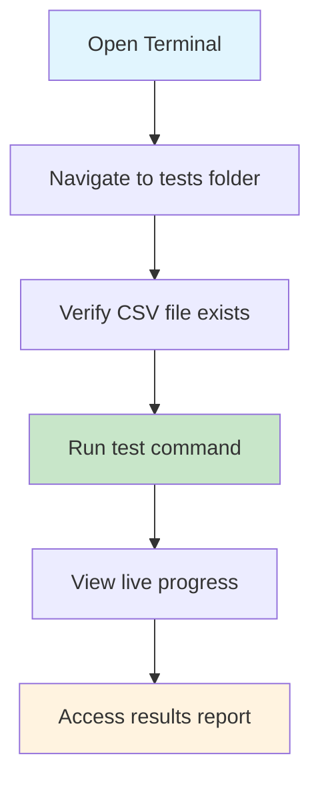
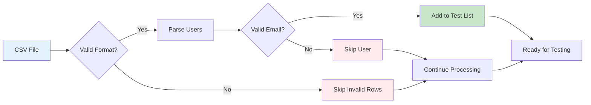
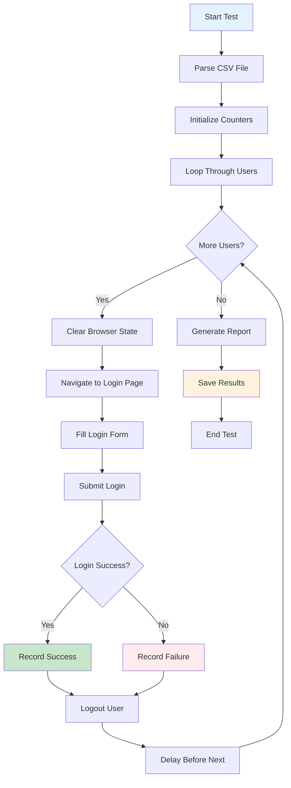

# Lucatris Login Testing - User Guide

## 📖 Overview

This user guide provides step-by-step instructions for running automated login tests against the Lucatris application. The testing suite validates user credentials from a CSV file and generates detailed reports on login success rates.

**Target Audience:** QA Engineers, Testers, and DevOps professionals

**Purpose:** Automate bulk user login testing to validate credentials and identify access issues.

---

## 🚀 Quick Start

### Prerequisites Checklist
- [ ] Node.js (v16 or higher) installed
- [ ] Playwright framework installed
- [ ] Access to the Lucatris application
- [ ] Test user credentials CSV file
- [ ] Command line/terminal access

### Running Your First Test



**Step-by-Step Instructions:**

1. **Open terminal** in your project directory
   
   

2. **Navigate to the tests folder:** `cd tests`

3. **Ensure CSV data file exists:** `../data/user qims regu.csv`

4. **Run the test:** `npx playwright test lucatris-login-email.spec.ts`

   

That's it! The test will automatically process all users and save results.

---

## 📁 Understanding Test Data

### CSV File Format

Your test data must be located at `../data/user qims regu.csv` with the following structure:

```csv
Name;Email;Role;Branch;ERP;QIMS Login;Lucatris;Remark
John Doe;john.doe@company.com;Admin;Jakarta;;Yes;Yes;Primary admin
Jane Smith;jane.smith@company.com;User;Surabaya;;Yes;Yes;Regular user
```


**Data Validation Flow:**



**Required Fields:**
- **Name** - User's full name
- **Email** - Valid email address (used for login)
- **Role** - User role/position (optional)
- **Branch** - Office location (optional)

**Validation Rules:**
- Must be semicolon-delimited (;) format
- Email addresses must contain "@"
- Empty lines are automatically skipped
- First row is treated as header and ignored

### Preparing Your CSV

1. **Export user data** from your system
2. **Format columns** in the correct order
3. **Save as CSV** with semicolon delimiters
4. **Place file** in the `data/` folder
5. **Validate emails** - only rows with valid emails will be tested

---

## 🔧 Test Configuration

### Default Settings
- **Test Timeout:** 30 minutes (1,800,000 ms)
- **Navigation Timeout:** 60 seconds
- **Delay Between Attempts:** 1 second
- **Login Password:** `rui123` (hardcoded)
- **Target URL:** `https://lucatris.com/auth`

### Customizing Configuration

Edit these values in the test file as needed:

```typescript
// Change test timeout (in milliseconds)
test.setTimeout(1800000); // 30 minutes

// Update default password
const password = 'your-password-here';

// Modify target URL
await page.goto('https://your-domain.com/auth', { timeout: 60000 });
```

---

## 📊 Running Tests

### Basic Execution

```bash
# Run specific test file
npx playwright test tests/lucatris-login-email.spec.ts

# Run with verbose output
npx playwright test tests/lucatris-login-email.spec.ts --reporter=list

# Run in headed mode (shows browser)
npx playwright test tests/lucatris-login-email.spec.ts --headed
```

### Advanced Options

```bash
# Run with specific browser
npx playwright test tests/lucatris-login-email.spec.ts --browser=chromium

# Run with retries
npx playwright test tests/lucatris-login-email.spec.ts --retries=2

# Generate HTML report
npx playwright test tests/lucatris-login-email.spec.ts --reporter=html
```

---

## 📈 Understanding Results

### Console Output

During execution, you'll see real-time progress:

```
========================================
Lucatris Login Test - Total users: 150
========================================

[1/150] Testing: John Doe (john.doe@company.com)
  ✓ SUCCESS - Logged in successfully (redirected to: https://lucatris.com/dashboard)

[2/150] Testing: Jane Smith (jane.smith@company.com)  
  ✗ FAILED - Invalid email or password
```


**Test Execution Process:**



### Report File

After completion, a detailed markdown report is generated:

**Location:** `../test-results/lucatris-login-results-[timestamp].md`


**Report Contents:**
- Executive summary with success/failure counts
- Detailed success logins table
- Detailed failure logins with error reasons
- Test execution metadata

#### Sample Report Structure

```markdown
# Lucatris Login Test Results

**Date:** 2026-01-30T10:30:00.000Z
**Password Used:** rui123

## Summary

| Metric | Count |
|--------|-------|
| Total Tested | 150 |
| Successful | 142 |
| Failed | 8 |

## Successful Logins (142)

| No | Name | Email | Role | Branch | Remark |
|----|------|-------|------|--------|--------|
| 1 | John Doe | john.doe@company.com | Admin | Jakarta | Login successful |

## Failed Logins (8)

| No | Name | Email | Role | Branch | Remark |
|----|------|-------|------|--------|--------|
| 2 | Jane Smith | jane.smith@company.com | User | Surabaya | Invalid email or password |
```


---

## 🛠️ Troubleshooting

### Common Issues

#### Test Won't Start
**Problem:** Test file not found or Playwright not installed
```bash
# Verify Playwright installation
npx playwright --version

# Install Playwright if needed
npm install @playwright/test

# Install browsers
npx playwright install
```

#### CSV File Not Found
**Problem:** `user qims regu.csv` missing
**Solution:** Ensure CSV file exists in the `data/` folder with correct filename

#### Login Failures for All Users
**Possible Causes:**
- Incorrect default password
- Application URL changed
- Network connectivity issues
- Application maintenance

#### Browser Timeouts
**Problem:** Tests taking too long
**Solutions:**
```typescript
// Increase timeout in test file
test.setTimeout(3600000); // 1 hour

// Increase navigation timeout
await page.goto('https://lucatris.com/auth', { timeout: 120000 }); // 2 minutes
```

### Debugging Tips

1. **Run in headed mode** to see browser actions:
   ```bash
   npx playwright test tests/lucatris-login-email.spec.ts --headed
   ```

2. **Add breakpoints** for debugging:
   ```typescript
   await page.pause(); // Add this line where you want to debug
   ```

3. **Check network connectivity:**
   ```bash
   ping lucatris.com
   ```

4. **Verify CSV format** with a text editor to ensure proper semicolon delimiting

---

## 📋 Best Practices

### Test Data Management
- **Regularly update** CSV with current user data
- **Test with small batches** first (5-10 users) before full runs
- **Backup CSV files** before making changes
- **Validate email format** before running large tests

### Test Execution
- **Schedule tests** during off-peak hours to minimize impact
- **Monitor system resources** during large batch runs
- **Keep test reports** for historical comparison
- **Use consistent naming** for CSV files and reports

### Security Considerations
- **Protect sensitive data** - CSV contains real user credentials
- **Use test accounts** when possible instead of production credentials
- **Secure storage** for CSV files with appropriate permissions
- **Limit access** to test results containing user information

---

## 🆘 Getting Help

### Resources
- **Playwright Documentation:** https://playwright.dev
- **Test Results Location:** `../test-results/` folder
- **Log Files:** Console output during execution

### Contact Support
If you encounter issues not covered in this guide:

1. **Document the error** with screenshots
2. **Collect relevant logs** from console output
3. **Note the circumstances** (data size, timing, environment)
4. **Check recent changes** to the application or test environment

---

## 📝 Version History

| Version | Date | Changes |
|---------|------|---------|
| 1.0 | 2026-01-30 | Initial user guide creation |

---

**💡 Pro Tip:** Start with a small test dataset (3-5 users) to validate your setup before running large batch tests. This saves time and helps identify configuration issues quickly.

**⏱️ Time Management:** For datasets larger than 100 users, consider running tests overnight or during maintenance windows to minimize system impact.